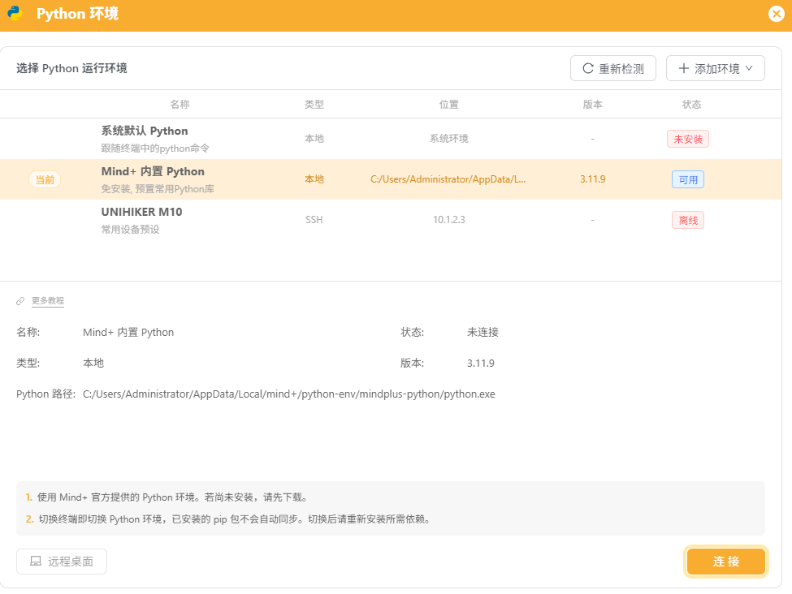
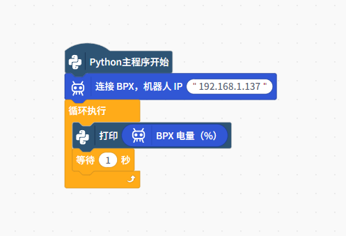

# BPX 接入 Mind+ 指导说明书

## 一、准备机器人和网络

1. 打开 BPX 机器人电源。
2. 记下机器人 IP。本文示例使用 `192.168.1.137`。
3. 确保电脑和机器人连接到同一个局域网。

## 二、进入 Python 积木模式

1. 打开 Mind+。
2. 进入“程序设计”。
3. 选择“Python 积木模式”。
4. 新建一个项目。
5. 开始时左上角会显示 Python 未连接。点击后下载内置 Python，下载完成后点击连接。




最终顶部应显示：`Mind+ 内置 Python 3.11.9 - 连接成功`。

## 三、打开扩展库开发者模式

1. 点击 Mind+ 右上角的齿轮。
2. 找到“扩展库开发者模式”并打开。
3. 返回编程页面。
4. 点击左下角橙色的“扩展”。
5. 如果扩展页面左下角已经显示“加载测试扩展”，说明开发者模式已经打开，可以直接进行下一步。


## 四、加载 BPX Python 积木扩展

1. 从 [v0.1.2 Release](https://github.com/mirrormerobotics/bpx-mindplus-extension/releases/tag/v0.1.2) 下载并解压 `MindPlus-extension-mirrormerobotics-bpxRobot-v0.1.2.zip`。
2. 在扩展页面左下角点击“加载测试扩展”。
3. 选择解压目录中的 `config.json`。
4. 加载成功后，扩展页面会出现带“测试”标志的“BPX机器人”卡片。
5. 点击卡片将它加载到项目中，然后点击左上角“返回”。

扩展页面大致如下：


## 五、确认 BPX 积木已经出现

回到编程页面后，检查左侧分类栏。应该能看到“BPX机器人”分类，点击后会出现：

- 连接 BPX
- BPX 已连接？
- BPX 站立
- BPX 坐下
- 其他运动和状态积木

如果看不到这些积木，点击“BPX机器人”标题旁边红色的“刷新”。


## 六、搭建打印电量程序

程序结构如下：



具体操作：

1. 保留画布上的“Python主程序开始”。
2. 打开左侧“BPX机器人”分类。
3. 将“连接 BPX，机器人 IP”拖到“Python主程序开始”下面。
4. 把 IP 修改为 `192.168.1.137`，实际使用时请填写你的机器人 IP。
5. 打开左侧“控制”分类。
6. 拖出“循环执行”，连接到“连接 BPX”下面。
7. 找到“打印”积木，放进循环里。
8. 从“BPX机器人”分类拖出椭圆形的“BPX 电量（%）”，把它放入“打印”积木的输入框。
9. 从“控制”分类拖出“等待 1 秒”，放在打印积木下面。

## 七、运行并查看结果

1. 点击右上角橙色的“运行”。
2. 程序首先连接机器人，可能需要等待几秒。
3. 连接成功后，右下角终端会每秒输出一次电量，例如：

```text
34
34
34
34
```

这里的 `34` 表示电量约为 34%。需要停止时，点击右上角的停止按钮。

## 扩展开发与打包

如果想开发自己的 Mind+ 扩展，本仓库的 `extension-builder` 目录提供了通用的 Mind+ V2 扩展打包工具，并保留 BPX 扩展作为完整示例。

它可以用于：

- 重新打包 BPX 扩展
- 修改或增加 BPX 积木
- 复制空白模板，开发其他 Mind+ 扩展
- 将扩展源码打包成 Mind+ 可以加载的 ZIP 文件

## SDK 子模块

本仓库通过 Git 子模块引用官方 SDK：[mirrormerobotics/bpx_sdk_open](https://github.com/mirrormerobotics/bpx_sdk_open)，路径为 `libraries/bpx_sdk_open`。

克隆仓库时请使用：

```bash
git clone --recurse-submodules https://github.com/mirrormerobotics/bpx-mindplus-extension.git
```
