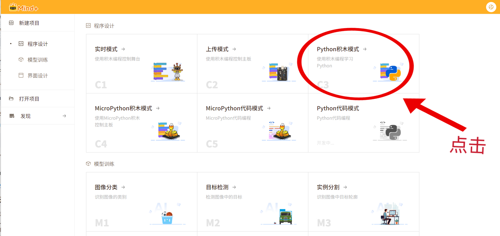
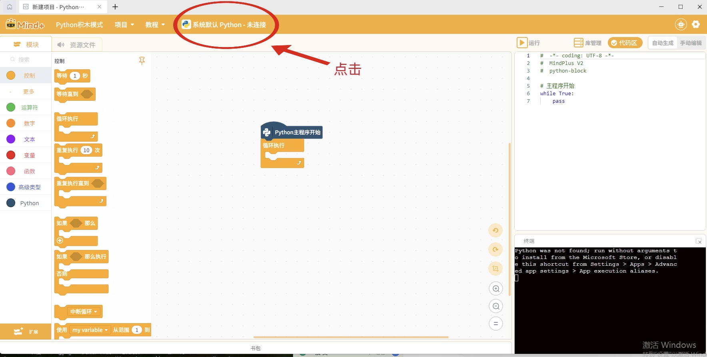
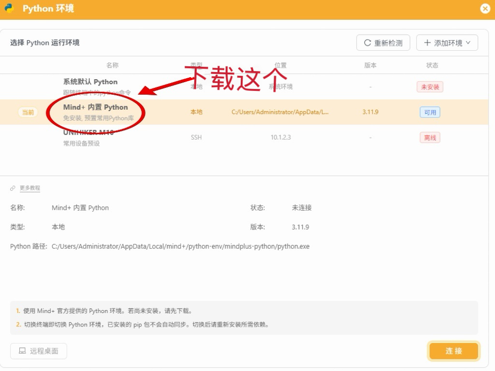
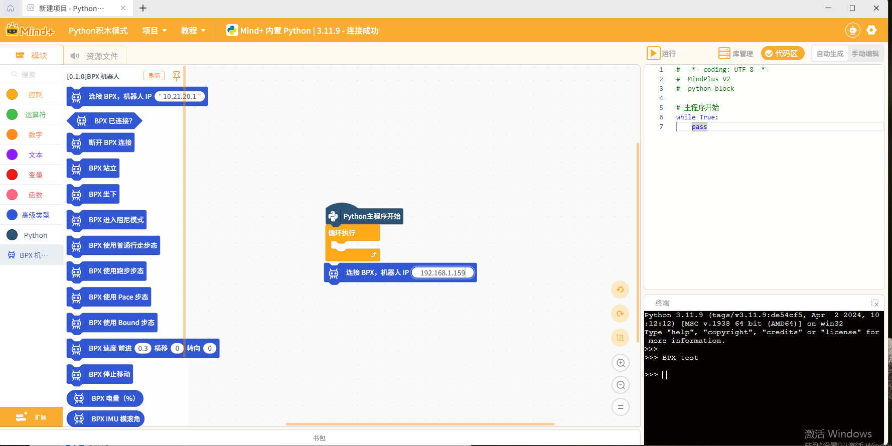
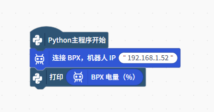
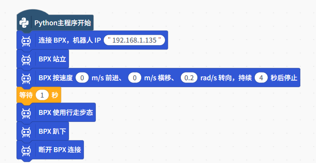
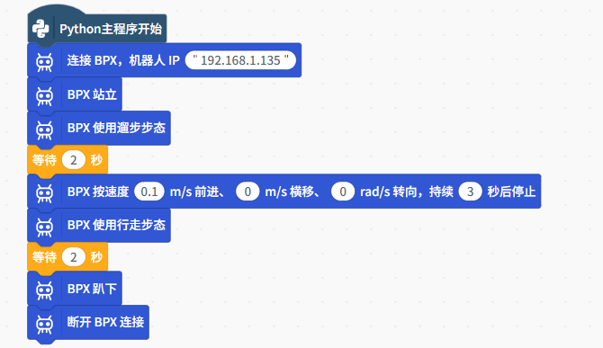
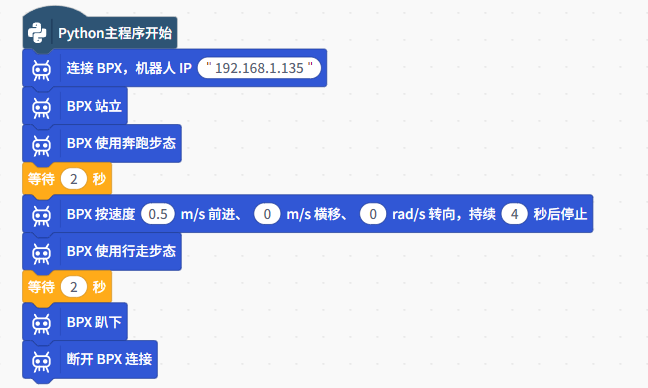
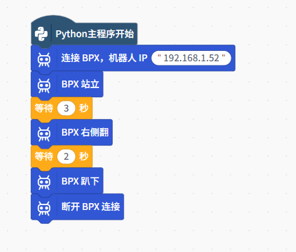

# BPX 接入 Mind+ 指导说明书

## 适用环境

本仓库当前发布的 BPX Mind+ Python 积木扩展包仅支持：

- Windows 10/11 64 位
- Mind+ V2.0.7 或更高版本
- Mind+ Python 积木模式

暂不支持 Linux 和 macOS。

## 一、准备机器人和网络

1. 打开 BPX 机器人电源。
2. 根据连接方式确定机器人 IP：

| 连接方式 | 操作方法 | 机器人 IP |
| --- | --- | --- |
| RJ45 网线直连 | 使用网线直接连接电脑和机器人 | `10.21.20.1` |
| 机器人 AP 热点 | 在电脑的 WiFi 列表中连接机器人开启的热点 | `10.21.40.1` |
| Station WiFi | 让机器人和电脑连接到同一个 WiFi | 使用机器人接入 WiFi 后获得的 IP |

使用 Station WiFi 时，可以在机器人状态或管理页面中查看 IP，也可以在路由器的已连接设备列表中查找机器人。本文中的示例 IP 为：

```text
192.168.1.52
```

该地址只是示例。不同机器人、路由器或网络环境分配的 IP 可能不同，请以实际显示的 IP 为准。

运行 Mind+ 程序前，可以在 Windows PowerShell 中测试网络：

```powershell
ping 192.168.1.52
```

请把命令中的 IP 替换成机器人的实际 IP。如果能够收到回复，说明电脑通常可以访问机器人；如果一直显示请求超时，请重新检查网络连接和 IP。

更多说明请参考：

[BPX SDK：网络连接与 IP](https://github.com/mirrormerobotics/bpx_sdk_open/blob/master/README.zh-CN.md#网络连接与-ip)

## 二、进入 Python 积木模式

1. 打开 Mind+。
2. 进入“程序设计”。
3. 选择“Python 积木模式”，新建一个项目。

   

4. 点击顶部的“Python 未连接”，选择“Mind+ 内置 Python”。如果尚未安装，请先下载；显示“可用”后，点击右下角“连接”。

   

   

   注：上图中的内置 Python 已显示“可用”，此时无需重复下载，选择该项后点击“连接”即可。

最终顶部应显示：`Mind+ 内置 Python 3.11.9 - 连接成功`。

## 三、打开扩展库开发者模式

“加载测试扩展”需要使用 Mind+ V2 的扩展库开发者模式。请使用 Mind+ V2.0.7 或更高版本。

1. 点击 Mind+ 右上角的齿轮。
2. 找到“扩展库开发者模式”并打开。
3. 返回编程页面。
4. 点击左下角橙色的“扩展”。
5. 如果扩展页面左下角已经显示“加载测试扩展”，说明开发者模式已经打开，可以进行下一步。

如果设置中没有“扩展库开发者模式”，请先升级 Mind+，然后重新打开软件。

## 四、加载 BPX Python 积木扩展

1. 从 [v0.1.3 Release](https://github.com/mirrormerobotics/bpx-mindplus-extension/releases/tag/v0.1.3) 下载并解压 `MindPlus-extension-mirrormerobotics-bpxRobot-v0.1.3.zip`。
2. 在扩展页面左下角点击“加载测试扩展”。
3. 选择解压目录中的 `config.json`。
4. 加载成功后，扩展页面会出现带“测试”标志的“BPX机器人”卡片。
5. 点击卡片将它加载到项目中，然后点击左上角“返回”。

扩展页面大致如下：


## 五、确认 BPX 积木已经出现

回到编程页面后，检查左侧分类栏。应该能看到“BPX机器人”分类，点击后会出现：

- 连接 BPX
- BPX 已连接？
- BPX 站立
- BPX 趴下
- 其他运动和状态积木




## 六、确认 BPX 是否可以连接

先搭建一个只读取电量、不控制机器人运动的程序，确认电脑能够与 BPX 通信。

具体操作：

1. 保留画布上的“Python主程序开始”。
2. 打开左侧“BPX机器人”分类，将“连接 BPX，机器人 IP”拖到“Python主程序开始”下面。
3. 把 IP 改成自己机器人的实际 IP。图中 `192.168.1.52` 仅为示例。
4. 找到“打印”积木，将它连接在“连接 BPX”下面。
5. 从“BPX机器人”分类拖出椭圆形的“BPX 电量（%）”，放进“打印”积木的输入框。




## 七、运行并查看结果

1. 点击右上角橙色的“运行”。
2. 程序先连接机器人，可能需要等待几秒。
3. 连接成功并取得电量数据后，右下角终端会输出一次电量，例如：

```text
34
```

这里的 `34` 表示电量约为 34%。程序中途需要停止时，点击右上角的停止按钮。

## 八、常用积木及用法

下面的示例均使用 0.1.3 扩展。每张图是一个独立程序。图中的 IP 请替换成实际地址。

示例截图中的“BPX 卧下”对应本版本的“BPX 趴下”积木。

### 1. 关节重置

“BPX 关节重置（需贴地姿态）”用于向机器人发送一次位置标零请求，随后等待 1 秒。它不是让机器人站立，也不是普通的停止指令。

- 正常使用时，如果机器人已经完成正确初始化，不必重置。
- 仅在机器人使用说明或技术支持明确要求重新标零时使用。
- **执行前必须确认机器人足底、小腿以及小腿和大腿连接处均接触地面。**

标零姿态要求见 [官方 SDK 运控调用层说明](https://github.com/mirrormerobotics/bpx_sdk_open/blob/master/README.zh-CN.md#运控调用层)。

### 2. 按指定速度运动一段时间，然后停止

以图中的积木为例：

```text
BPX 按速度 前进［0］横移［0］转向［0.2］持续［4］秒后停止
```

含义是：按转向参数 `0.2` 运动约 4 秒，然后自动执行停止流程。



这个积木可以近似等效为以下结构（循环调用会产生少量额外耗时）：

```text
重复执行［20］次
    BPX 速度 前进［0］横移［0］转向［0.2］
    等待［0.2］秒
BPX 停止移动
```


### 3. 切换步态

“BPX 使用……步态”用于选择步态；
下面以遛步、奔跑为例。

**遛步：**




**奔跑：**



示例参数不代表适用于所有场地和机器人状态，应先在安全条件下低速测试。

### 4. 侧翻

右侧翻可以按下图搭建：



仅在有足够空间和安全保障的条件下操作。


## 扩展开发与打包

如果想开发自己的 Mind+ 扩展，本仓库的 `extension-builder` 目录提供了通用的 Mind+ V2 扩展打包工具，并保留 BPX 扩展作为完整示例。

它可以用于：

- 重新打包 BPX 扩展
- 修改或增加 BPX 积木
- 复制空白模板，开发其他 Mind+ 扩展
- 将扩展源码打包成 Mind+ 可以加载的 ZIP 文件

## SDK 子模块

本仓库通过 Git 子模块引用官方 SDK：[mirrormerobotics/bpx_sdk_open](https://github.com/mirrormerobotics/bpx_sdk_open)，路径为 `libraries/bpx_sdk_open`。

克隆仓库时请使用：

```bash
git clone --recurse-submodules https://github.com/mirrormerobotics/bpx-mindplus-extension.git
```
