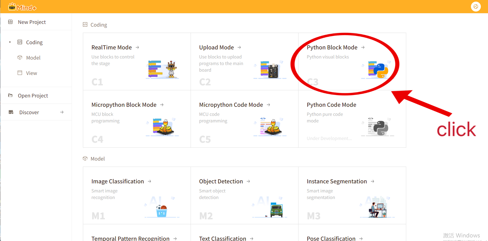
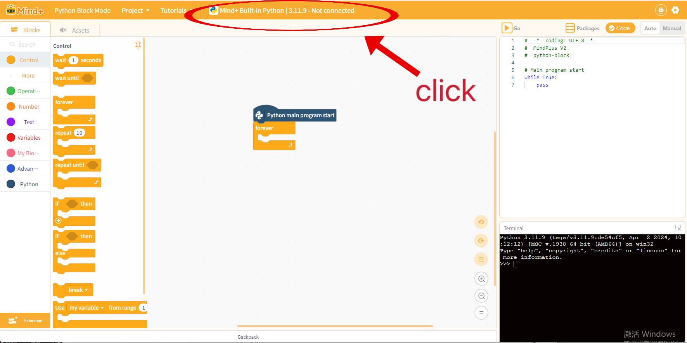
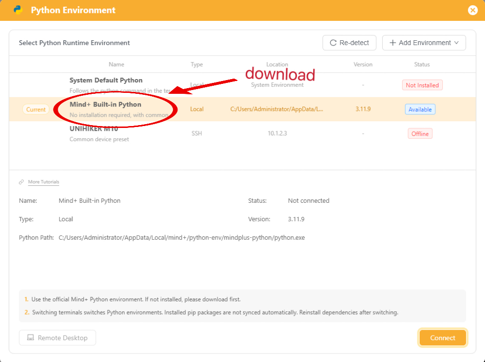
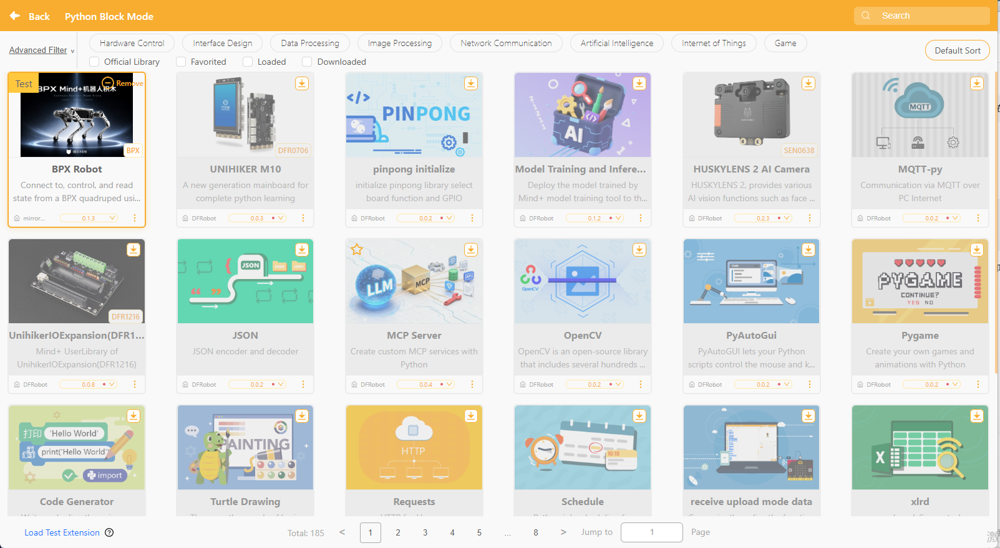
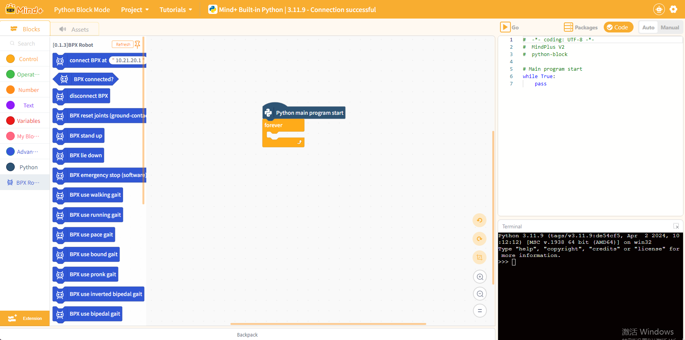
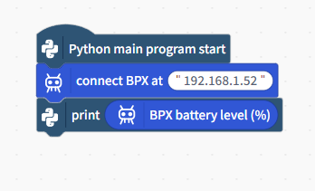
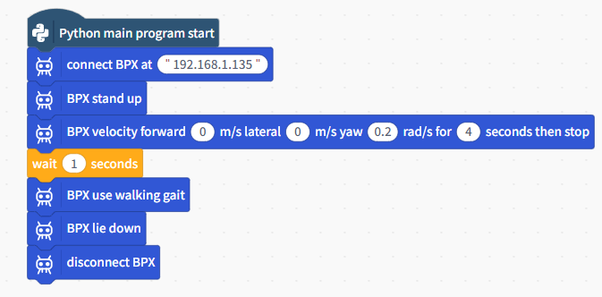
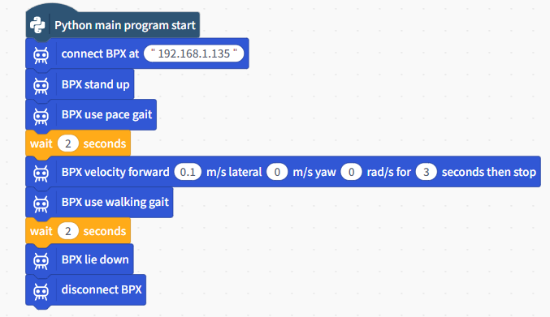
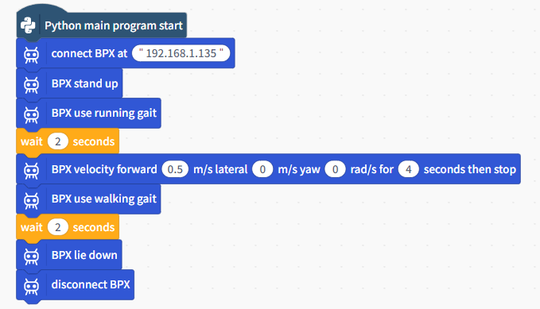
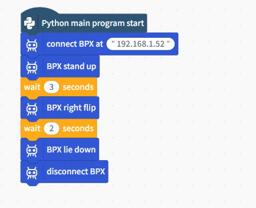

# Using BPX with Mind+

English | [中文](README.zh-CN.md)

## Supported Environment

The current BPX Mind+ Python block extension supports:

- 64-bit Windows 10/11
- Mind+ V2.0.7 or later
- Mind+ Python Block Mode

Linux and macOS are not currently supported.

## 1. Prepare the Robot and Network

1. Turn on the BPX robot.
2. Determine the robot IP address according to the connection method:

| Connection | How to connect | Robot IP |
| --- | --- | --- |
| Direct RJ45 connection | Connect the computer directly to the robot with an Ethernet cable | `10.21.20.1` |
| Robot AP hotspot | Connect the computer to the Wi-Fi hotspot created by the robot | `10.21.40.1` |
| Station Wi-Fi | Connect the robot and computer to the same Wi-Fi network | Use the IP assigned to the robot on that Wi-Fi network |

When using Station Wi-Fi, check the IP on the robot status or management page, or find the robot in the router's connected-device list. The example IP used in this guide is:

```text
192.168.1.52
```

This is only an example. The address assigned to your robot may be different; always use the IP shown in your own network environment.

Before running the Mind+ program, you can test network connectivity in Windows PowerShell:

```powershell
ping 192.168.1.52
```

Replace the example address with the actual robot IP. Replies generally indicate that the computer can reach the robot. If every request times out, check the network connection and IP again.

For more information, see [BPX SDK: Network Connection and IP](https://github.com/mirrormerobotics/bpx_sdk_open#network-connection-and-ip).

## 2. Enter Python Block Mode

1. Open Mind+.
2. Enter **Program Design**.
3. Select **Python Block Mode** and create a project.

   

4. Click **Python not connected** at the top and select **Mind+ built-in Python**. Download it first if it is not installed. When its status becomes available, click **Connect** in the lower-right corner.

   

   

   In the image, built-in Python is already marked as available, so it does not need to be downloaded again. Select it and click **Connect**.

The top bar should finally show `Mind+ built-in Python 3.11.9 - connected successfully` or an equivalent connected status.

## 3. Enable Extension Developer Mode

Loading a test extension requires Extension Developer Mode in Mind+ V2. Use Mind+ V2.0.7 or later.

1. Click the gear icon in the upper-right corner of Mind+.
2. Find and enable **Extension Developer Mode**.
3. Return to the programming page.
4. Click the orange **Extensions** button in the lower-left corner.
5. If **Load Test Extension** appears in the lower-left corner of the extension page, Developer Mode is enabled.

If this setting is unavailable, update Mind+ and reopen the application.

## 4. Load the BPX Python Block Extension

1. Download `MindPlus-extension-mirrormerobotics-bpxRobot-v0.1.3.zip` from the [v0.1.3 release](https://github.com/mirrormerobotics/bpx-mindplus-extension/releases/tag/v0.1.3), then extract the complete ZIP.
2. Click **Load Test Extension** in the lower-left corner of the extension page.
3. Select `config.json` from the extracted directory.
4. After loading, a **BPX Robot** card marked **Test** appears on the extension page.
5. Click the card to add it to the project, then click **Back** in the upper-left corner.

The extension page should look similar to this:



## 5. Confirm That the BPX Blocks Are Available

Return to the programming page and check the category list on the left. Open **BPX Robot** to find blocks such as:

- Connect BPX
- BPX connected?
- BPX stand
- BPX lie down
- Other motion and state blocks




## 6. Confirm That BPX Can Connect

First build a program that reads the battery level without commanding robot motion.

1. Keep the **Python program starts** block on the canvas.
2. Open **BPX Robot**, then place **Connect BPX, robot IP** below the start block.
3. Replace the IP with the actual robot IP. `192.168.1.52` in the image is only an example.
4. Place a **print** block below **Connect BPX**.
5. Put the oval **BPX battery level (%)** reporter into the input of the print block.



## 7. Run the Program and View the Result

1. Click the orange **Run** button in the upper-right corner.
2. The program connects to the robot first, which may take a few seconds.
3. After a successful connection and battery reading, the terminal in the lower-right corner prints one value, for example:

```text
34
```

`34` means the battery level is approximately 34%. To stop the program while it is running, click the stop button in the upper-right corner.

## 8. Common Blocks and Usage

The following examples use extension version 0.1.3. Each image shows a separate program. Replace the example IP with the actual robot IP.


### 1. Joint Reset

**BPX joint reset (ground-contact pose required)** sends one zero-position request and then waits for one second. It does not make the robot stand and is not a normal stop command.

- If the robot has already been initialized correctly, a reset is not normally required.
- Use it only when the robot instructions or technical support explicitly require zeroing.
- **Before running it, make sure the feet, shanks, and the joints between the shanks and thighs are all in contact with the ground.**

See the zeroing-pose requirement in the [official SDK Motion Control Layer documentation](https://github.com/mirrormerobotics/bpx_sdk_open#motion-control-layer).

### 2. Move at a Specified Velocity and Then Stop

For example, this block:

```text
BPX move at velocity: forward [0], lateral [0], yaw [0.2], for [4] seconds, then stop
```

uses a yaw value of `0.2` for approximately four seconds and then automatically runs the stop sequence.



It is approximately equivalent to the following structure. Repeated calls introduce a small amount of additional execution time:

```text
repeat [20] times
    BPX velocity: forward [0], lateral [0], yaw [0.2]
    wait [0.2] seconds
BPX stop moving
```

### 3. Switch Gaits

Use a **BPX use ... gait** block to select a gait. The following examples show Pace and Running.

**Pace:**



**Running:**



The example values are not guaranteed to suit every surface or robot state. Begin with a low speed under safe conditions.

### 4. Side Flip

A right-side flip can be arranged as follows:



Run this action only with sufficient clear space and appropriate safety precautions.

## Extension Development and Packaging

The `extension-builder` directory provides a general-purpose Mind+ V2 extension packaging tool and retains the BPX extension as a complete example.

It can be used to:

- Rebuild the BPX extension
- Modify or add BPX blocks
- Copy the blank template to develop another Mind+ extension
- Package extension source into a ZIP that Mind+ can load

## SDK Submodule

This repository includes the official [mirrormerobotics/bpx_sdk_open](https://github.com/mirrormerobotics/bpx_sdk_open) SDK as a Git submodule at `libraries/bpx_sdk_open`.

Clone the repository with:

```bash
git clone --recurse-submodules https://github.com/mirrormerobotics/bpx-mindplus-extension.git
```
